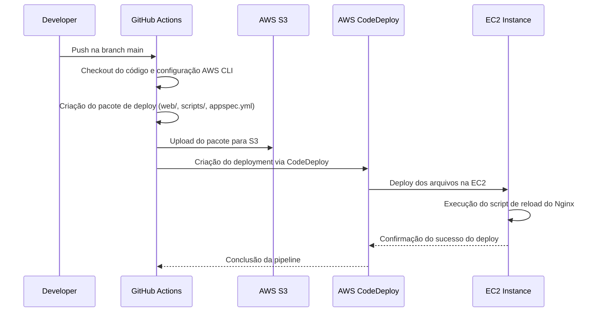

# 🚀 Pipeline de Entrega Contínua com GitHub Actions, AWS S3 e CodeDeploy

Este projeto demonstra uma pipeline de entrega contínua automatizada para uma aplicação web estática hospedada em uma instância EC2, utilizando **GitHub Actions**, **AWS S3** e **AWS CodeDeploy**.

O objetivo é garantir deploys consistentes, seguros e rastreáveis, reduzindo a intervenção manual e acelerando o fluxo de entrega.

---

## 📌 Visão Geral

A pipeline foi desenhada para ser simples, eficiente e segura. Ao realizar um push na branch `main`, todo o processo de build, empacotamento, upload e deploy acontece automaticamente até a aplicação estar disponível no ambiente de produção.

---

## 💻 Tecnologias Utilizadas

| Ferramenta        | Função                                            |
|--------------------|---------------------------------------------------|
| GitHub Actions     | Orquestra o pipeline CI/CD                        |
| AWS S3             | Armazenamento do artefato de deploy               |
| AWS CodeDeploy     | Gerencia o deploy na instância EC2               |
| AWS CLI            | Interface de automação com a AWS via terminal     |

---
## 🔗 Fluxo da Pipeline



## 📂 Estrutura do Deploy

### appspec.yml
```yaml
version: 0.0
os: linux
files:
  - source: web/
    destination: /var/www/html/
hooks:
  AfterInstall:
    - location: scripts/reload_nginx.sh
      timeout: 30
      runas: root
```

Este arquivo instrui o **CodeDeploy** a:

- Copiar a pasta `web/` para o diretório padrão do Nginx.
- Executar o script `reload_nginx.sh` como **root**, logo após a instalação dos arquivos.
- Respeitar o **timeout** definido para o hook.

---

## ✅ Benefícios da Pipeline

- **Automação ponta a ponta**: Do push ao deploy sem etapas manuais.
- **Segurança reforçada**: Secrets protegidos no GitHub e execução controlada de scripts.
- **Consistência e rastreabilidade**: Cada deploy vinculado a um commit específico.
- **Escalabilidade**: Fácil adaptação para múltiplos ambientes ou aplicações.

---

## 🔐 Considerações de Segurança

- As credenciais AWS são armazenadas de forma segura nos **Secrets do GitHub**.
- Scripts executados como **root** apenas quando necessário.
- **Timeouts** bem definidos evitam processos travados ou inconsistências.
- Uso de políticas de acesso com o **mínimo necessário** em todos os serviços AWS.

---

## 📘 Como usar

1. Realize o **push do código na branch `main`**.
2. A pipeline será automaticamente acionada pelo **GitHub Actions**.
3. O artefato será enviado ao **S3** e o deploy realizado na **EC2 via CodeDeploy**.
4. Acompanhe o status do deploy diretamente pelo **GitHub Actions** ou **CodeDeploy**.

---

## 💡 Observação

Este projeto é um modelo básico para **aplicações web estáticas em EC2**, mas a mesma estrutura pode ser facilmente adaptada para **aplicações backend, APIs ou múltiplos ambientes (staging, homologação, produção)**.
